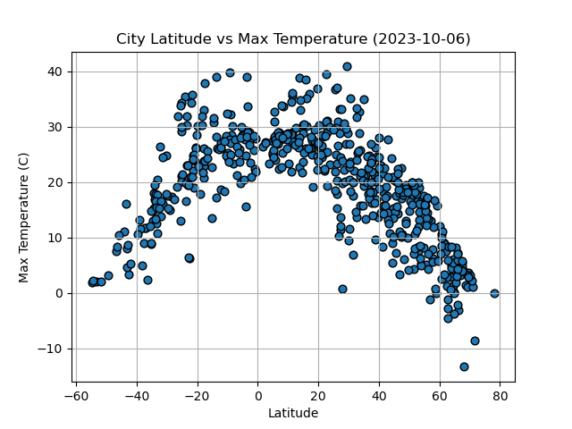
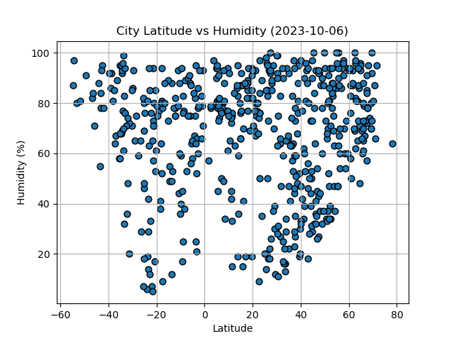
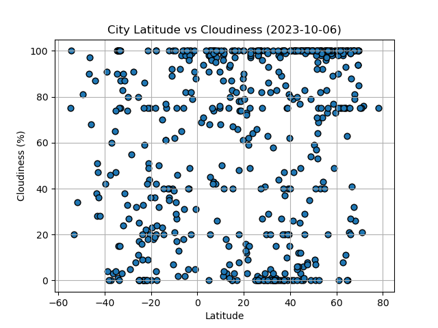
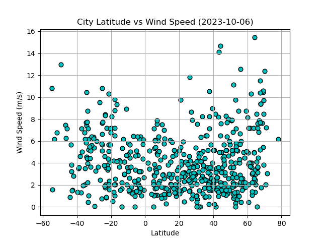

# python-api-challenge
 **week 6**  
Inside WeatherPy folder, you'll find  
<ol>
<li> WeatherPy.ipynb  </li>
<li> VacationPy.ipynb  </li>
    The two notebooks for the 2 parts of the assignment.
    WeatherPy.ipynb also contains the analysis observation for each of the linear regression pairs.
<li> output_data folder: 
    contains the output from the notebooks, namely </li>
  <ol>  
  <li> Fig 1 to 4, the graph printouts from WeatherPy.ipynb (as shown below)</li>
  <li> cities.csv contains the city names and weather info generated by WeatherPy.ipynb, which is used in VacationPy.ipynb</li>
  <li> city_hotels.csv contains the city name as well as hotel found in VacationPy.ipynb, because the API took a long time to finish running, so I thought I would save an output as file. </li>
  </ol>
</ol>
     

 

 

 

